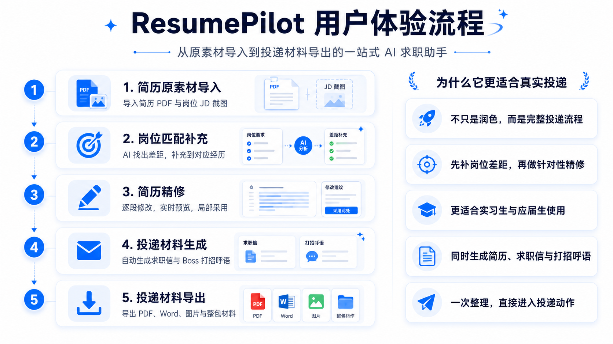

# ResumePilot

ResumePilot 是一款面向实习生与应届生的“一站式 AI 求职助手”，把简历原素材导入、岗位匹配补充、简历精修、投递材料生成与导出串成一条完整流程，帮助用户更高效地完成真实投递准备。

## 项目简介

ResumePilot 不是一个只会“润色几句话”的简历工具，而是一套围绕真实投递流程设计的 AI 求职产品原型。

它会先帮助用户导入简历与岗位信息，生成结构化 Draft，再基于岗位要求识别简历中的关键差距，补充完必要信息后进入逐段 AI 精修，最后统一生成并导出适合不同投递场景使用的材料。

如果用一句话概括它的价值，就是：

> 不止帮你润色，更帮你补齐岗位差距，并把最后要发出去的整套投递材料一起准备好。

项目当前更适合：

- 实习生
- 应届生
- 需要针对不同岗位快速调整简历的人
- 希望同时生成简历、求职信和打招呼语的人

## 适用人群 / 不适用人群

### 更适合谁

- 正在准备实习投递的学生
- 正在准备校招或毕业求职的应届生
- 已经有一版简历，但不知道怎样更贴近目标岗位的人
- 希望把简历、求职信、打招呼语一次整理完成的人

### 暂时不太适合谁

- 需要多页高管简历的人
- 需要极强行业定制化写作的资深职场候选人
- 希望完全离线运行、不调用外部模型服务的人
- 不准备人工复核导出结果、希望零检查直接投递的人

## 用户体验流程与卖点

下面这张图更适合第一次了解项目时快速建立整体印象：



这套流程的核心价值不是“把一句话改得更好看”，而是把真实投递里最容易卡住的几步串起来：

- 先导入原始简历和岗位 JD，而不是从空白页开始写
- 先补齐岗位差距，再进入逐段精修
- 精修时支持按经历、按模块逐步修改和采用
- 不只产出简历，还会同步生成求职信与 Boss 打招呼语
- 最后统一导出，直接进入真实投递动作

## 核心功能

- 简历原素材导入
  - 支持导入简历 PDF
  - 支持导入岗位 JD 截图
  - 自动完成基础解析与结构化预填

- 岗位匹配补充
  - 基于简历与目标岗位的差距生成补充表单
  - 引导用户把差距信息分配到更合适的经历中
  - 先补信息，再进入后续精修

- 简历精修
  - 支持按模块、按经历逐段修改
  - 支持 AI 生成优化版本并映射到右侧预览
  - 支持继续修改与采用结果

- 投递材料生成
  - 生成邮件求职信
  - 生成 Boss 直聘打招呼语
  - 支持不同模板方向

- 投递材料导出
  - 导出 PDF
  - 导出 Word 文档
  - 导出图片版本
  - 打包下载全部投递材料

## 完整使用流程

1. 导入简历 PDF 与岗位 JD 截图
2. 系统解析原始内容并生成文本简历、JD JSON 与 Draft JSON
3. 在附加材料预选页选择求职信与打招呼语模板
4. 进入岗位匹配补充页，完成差距信息补充
5. 系统基于补充结果完成对应经历的优化
6. 进入 AI 精修页，对各模块继续逐段打磨
7. 在导出页统一导出 PDF、Word、图片、求职信与 Boss 打招呼语

## 技术栈

### 前端

- Next.js 15
- React 19
- TypeScript
- Tailwind CSS

### 导出与文档处理

- `docx`
- `html2canvas`
- `jspdf`
- `jszip`

### AI 能力

- DeepSeek API

## 本地启动

### 1. 进入项目目录

```bash
cd "/Users/alexis/Documents/New project/ai-resume-generator"
```

### 2. 安装依赖

```bash
npm install
```

### 3. 创建环境变量文件

复制一份示例文件：

```bash
cp .env.example .env.local
```

然后补充你的真实配置。

### 4. 启动开发环境

```bash
npm run dev
```

默认本地地址通常为：

```bash
http://localhost:3000
```

## 部署说明

### 推荐方式

这个项目是标准的 Next.js 应用，最适合直接部署到：

- Vercel
- Netlify
- 其他支持 Node.js / Next.js 的平台

### 部署前需要准备

1. 一份可用的 DeepSeek API Key
2. 线上环境变量
3. Node.js 运行环境

### 最基本的线上环境变量

至少需要配置：

```bash
DEEPSEEK_API_KEY=your_real_key
DEEPSEEK_BASE_URL=https://api.deepseek.com
```

如果你希望线上行为和本地保持一致，建议把 [`.env.example`](/Users/alexis/Documents/New%20project/ai-resume-generator/.env.example) 中的模型配置一并同步到部署平台。

### Vercel 部署思路

1. 将仓库推到 GitHub
2. 在 Vercel 中导入该仓库
3. 添加环境变量
4. 执行默认构建命令：

```bash
npm install
npm run build
```

### Netlify / 其他平台

如果部署平台支持 Next.js，一般也可以直接使用：

```bash
npm install
npm run build
```

如果后续你准备公开给别人在线体验，我建议优先选 Vercel，因为它对 Next.js 的适配最省心。

## 环境变量说明

### 必填

项目至少需要以下环境变量才能调用 DeepSeek：

```bash
DEEPSEEK_API_KEY=your_deepseek_api_key_here
DEEPSEEK_BASE_URL=https://api.deepseek.com
```

### 全局默认模型

如果你希望大多数接口默认走同一个模型，可以先配置这一项：

```bash
DEEPSEEK_MODEL=deepseek-v4-pro
```

### 各模块单独模型（可选）

如果你希望不同链路分别使用不同模型，可以继续补下面这些；不填时会回退到代码中的默认值：

```bash
DEEPSEEK_RESUME_PARSE_MODEL=deepseek-v4-flash
DEEPSEEK_JD_PARSE_MODEL=deepseek-v4-flash
DEEPSEEK_DRAFT_JSON_MODEL=deepseek-v4-flash
DEEPSEEK_BRANCH_GAP_MODEL=deepseek-v4-flash
DEEPSEEK_BRANCH_MEMORY_MODEL=deepseek-v4-flash
DEEPSEEK_OPTIMIZE_MODEL=deepseek-v4-flash
DEEPSEEK_REFINE_MODEL=deepseek-v4-flash
DEEPSEEK_COVER_LETTER_MODEL=deepseek-v4-flash
DEEPSEEK_BOSS_GREETING_MODEL=deepseek-v4-flash
```

### 超时类可选配置

项目中还支持为部分解析接口单独配置超时，例如：

```bash
DEEPSEEK_RESUME_PARSE_TIMEOUT_MS=20000
DEEPSEEK_JD_PARSE_TIMEOUT_MS=20000
```

### 推荐做法

本地开发时，最简单的方式是：

1. 复制 [`.env.example`](/Users/alexis/Documents/New%20project/ai-resume-generator/.env.example) 为 `.env.local`
2. 先只填写 `DEEPSEEK_API_KEY`
3. 如果没有特殊需要，其他模型变量可以先保持示例值不动
4. 如果某条链路响应慢，再单独微调对应模型或超时配置

## 主要模块说明

### 页面主入口

- [`src/app/page.tsx`](/Users/alexis/Documents/New%20project/ai-resume-generator/src/app/page.tsx)
  - 整个多步骤流程的前端入口
  - 包含导入、岗位匹配补充、AI 精修和导出页逻辑

### 核心 API

- [`src/app/api/parse-resume/route.ts`](/Users/alexis/Documents/New%20project/ai-resume-generator/src/app/api/parse-resume/route.ts)
  - 解析简历文本与结构化信息

- [`src/lib/parse-jd.ts`](/Users/alexis/Documents/New%20project/ai-resume-generator/src/lib/parse-jd.ts)
  - 解析目标岗位 JD

- [`src/app/api/generate-draft-json/route.ts`](/Users/alexis/Documents/New%20project/ai-resume-generator/src/app/api/generate-draft-json/route.ts)
  - 生成 Draft JSON

- [`src/app/api/branch-gap-analysis/route.ts`](/Users/alexis/Documents/New%20project/ai-resume-generator/src/app/api/branch-gap-analysis/route.ts)
  - 分析岗位差距并生成补充问题

- [`src/app/api/branch-memory-writer/route.ts`](/Users/alexis/Documents/New%20project/ai-resume-generator/src/app/api/branch-memory-writer/route.ts)
  - 将岗位匹配补充表单结果结构化写入运行态

- [`src/app/api/optimize/route.ts`](/Users/alexis/Documents/New%20project/ai-resume-generator/src/app/api/optimize/route.ts)
  - 用于岗位匹配补充后的增强优化

- [`src/app/api/refine/route.ts`](/Users/alexis/Documents/New%20project/ai-resume-generator/src/app/api/refine/route.ts)
  - 用于第四页 AI 精修阶段的局部精修

- [`src/app/api/generate-cover-letter/route.ts`](/Users/alexis/Documents/New%20project/ai-resume-generator/src/app/api/generate-cover-letter/route.ts)
  - 生成邮件求职信

- [`src/app/api/generate-boss-greeting/route.ts`](/Users/alexis/Documents/New%20project/ai-resume-generator/src/app/api/generate-boss-greeting/route.ts)
  - 生成 Boss 直聘打招呼语

## 项目目录结构

```text
ai-resume-generator/
├── src/
│   ├── app/
│   │   ├── api/
│   │   │   ├── branch-gap-analysis/
│   │   │   ├── branch-memory-writer/
│   │   │   ├── generate/
│   │   │   ├── generate-boss-greeting/
│   │   │   ├── generate-cover-letter/
│   │   │   ├── generate-draft-json/
│   │   │   ├── optimize/
│   │   │   ├── parse-resume/
│   │   │   └── refine/
│   │   └── page.tsx
│   └── lib/
│       ├── parse-jd.ts
│       └── ...
├── .env.example
├── package.json
└── README.md
```

## 当前状态

当前版本已经具备以下能力：

- 简历 PDF 与岗位 JD 截图导入
- 简历 / JD 解析
- Draft JSON 生成
- 岗位匹配补充
- AI 精修
- 求职信与 Boss 打招呼语生成
- PDF / Word / 图片导出

## 开源协议

本项目当前使用 [MIT License](/Users/alexis/Documents/New%20project/ai-resume-generator/LICENSE)。

## 免责声明与使用建议

### 免责声明

- 本项目用于辅助简历优化与投递材料生成，不构成任何就业、录用或职业结果承诺
- 所有 AI 生成内容都可能出现理解偏差、表达不准或信息遗漏
- 使用者应自行确认简历、求职信、打招呼语中的事实真实性与最终表达
- 因使用本项目生成内容而产生的投递结果、沟通风险或信息错误，需要由使用者自行承担最终判断责任

### 使用建议

- 在正式投递前，务必逐条复核导出的简历内容
- 对数据、结果、项目职责和技能描述，优先以真实经历为准
- 对求职信与打招呼语，建议结合具体公司和岗位再做一次人工微调
- 如果目标岗位非常重要，建议在最终投递前再进行一次完整人工检查

## 已知限制

- 当前核心 AI 能力依赖 DeepSeek 服务可用性
- 部分导出与复杂交互效果仍建议在真实投递前手动复核
- 产品流程已较完整，但 README、环境变量说明和部署文档仍适合继续补强
